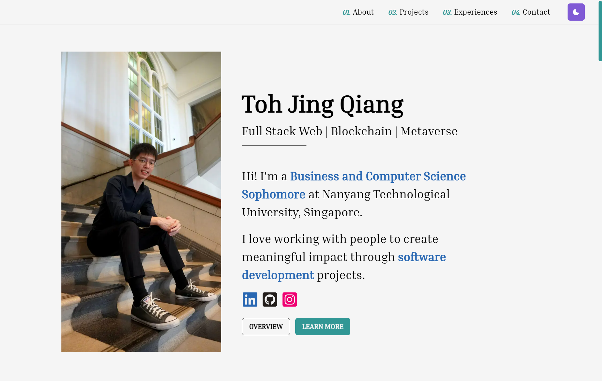
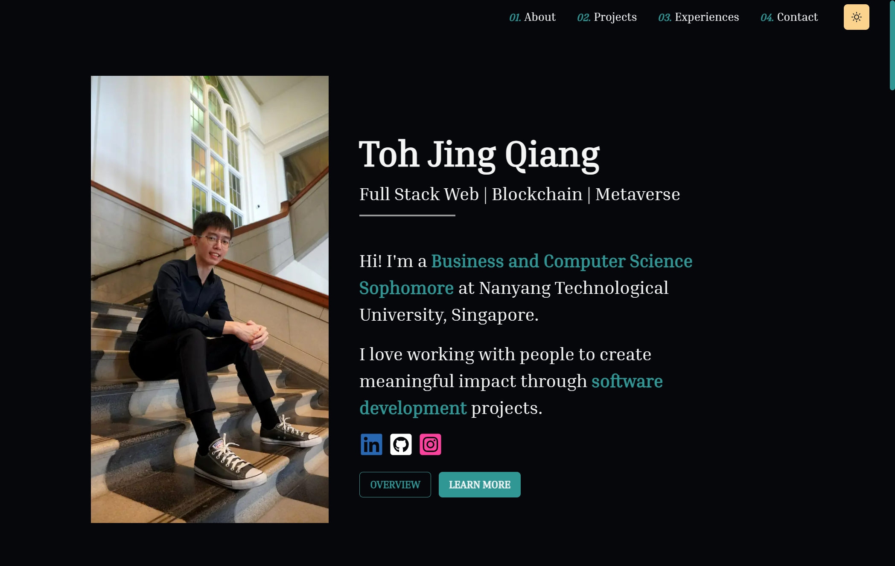

# Jing Qiang's Portfolio Website

**Tech Stack:**

 

 

## [Website](https://tohjingqiang.com/)

  
Video

  <dl>
  
https://user-images.githubusercontent.com/47933193/205600456-09c4ea17-d329-4745-b768-99bac6e297cd.mp4

  </dl>

 

## Figma Design (2022)

View the full figma design [here](https://www.figma.com/file/75wb2mLCke0B8FXzni4bVb/Portfolio-Website-V2?node-id=0%3A1&t=mvAOFoxX5mNR08nE-1).

 

## License:
- **DO NOT** use the 3d voxel fox designed by me.

 

## Want to learn more?
✉ Contact me if you are interested in learning more about how I implemented my portfolio website

 

## Archives:

Version 1 (2021)

<dl>

 

 

## Website

## Tech Stack
- `React` to build front end
- `JavaScript` to implement the features logic
- `HTML` & `CSS` for front end design and responsiveness

## Key Features
- <b>`Mobile Responsive`</b>

- <b>`Scrolling Animation Bar`</b>

- <b>`Single Page Navigation`</b>
  - Navigate to different sections of the page
    - `Landing Page Navigation`
    - `Hamburger Menu Navigation`

- <b>`Custom Cursor`</b> & <b>`Hover Cursor`</b>
  - Implemented using CSS & JavaScript

- <b>`Projects Filtering`</b>
  - Filter projects according to languages and categories
- <b>`Project Flip Cards`</b>
  - Appear on hover 

- <b>`Mobile Responsive Timeline`</b>

- <b>`Hover Effects`</b>
  - Special hover effects for some components

</dl>

